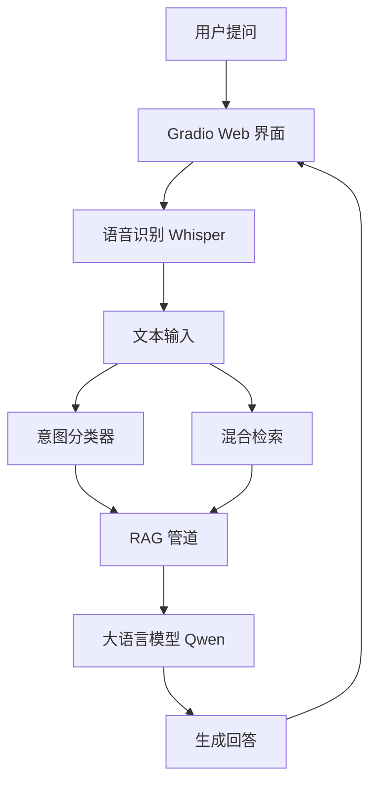
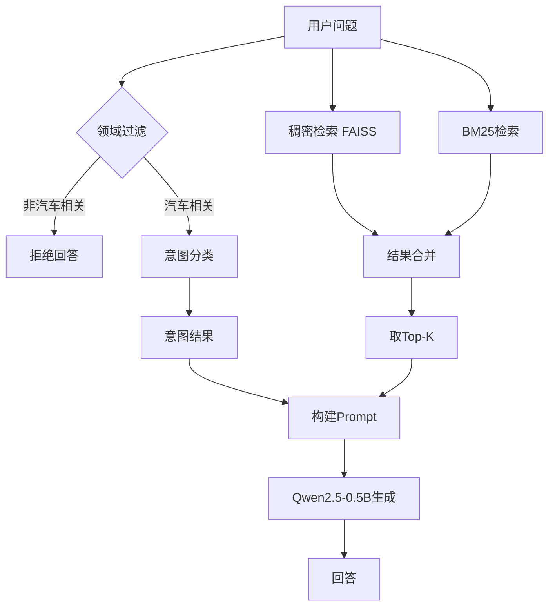
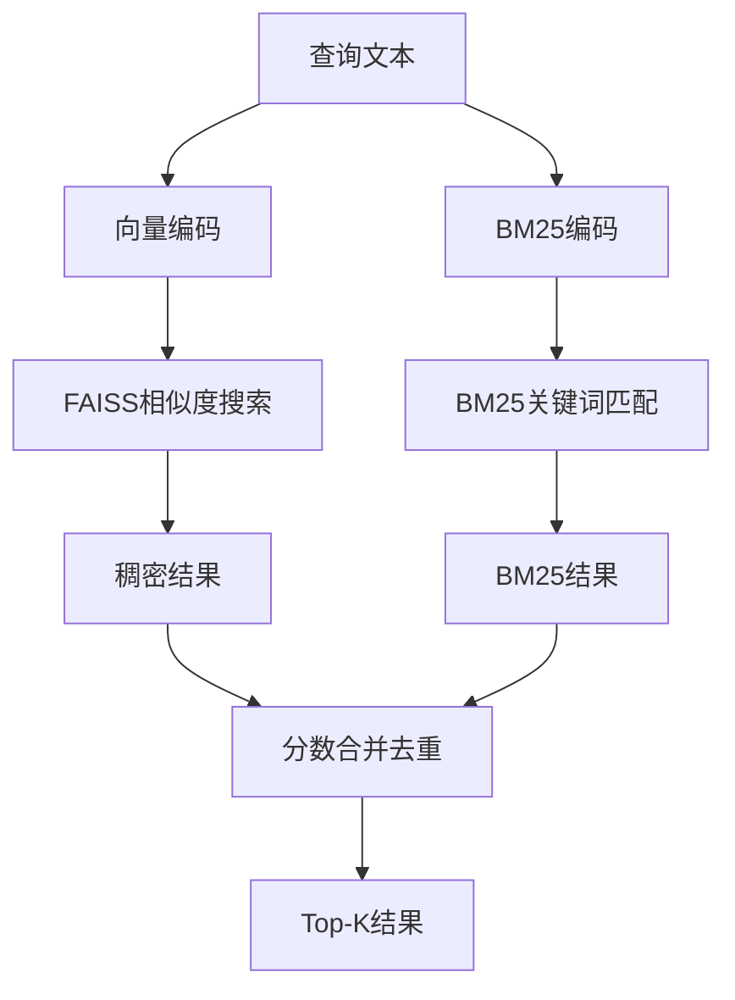
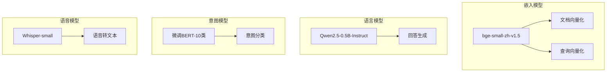
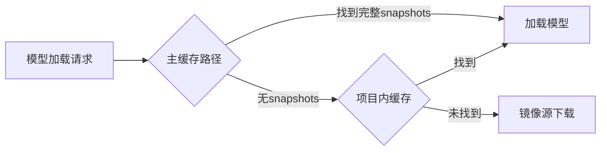
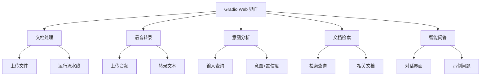
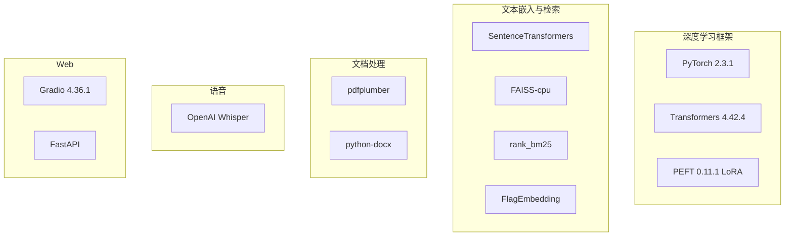

# 🚗 汽车座舱 RAG 系统 — 完整学习手册

> **项目定位**：基于 RAG（检索增强生成）技术的汽车座舱智能助手，面向车辆手册问答场景。  
> 用户可以输入关于车辆使用、维护、故障诊断等问题，系统从车辆手册中检索相关内容并生成回答。

---

## 一、系统总览

### 1.1 一句话理解

**用户提问 → 意图识别 → 文档检索 → 大模型生成回答**

### 1.2 系统架构图



### 1.3 五大核心能力

| 能力 | 说明 | 对应模块 |
|------|------|----------|
| 文档处理 | PDF/TXT/DOCX → 解析 → 清洗 → 分块 → FAISS 索引 | `data_process/` `vector_store/` |
| 语音识别 | Whisper 实时转录多格式音频 | `speech_asr/` |
| 意图分类 | 10 类车辆意图识别 | `intent_cls/` |
| 智能检索 | BM25 + 稠密向量混合检索 | `retriever/` |
| 智能问答 | RAG 增强生成 | `llm_infer/` |

---

## 二、项目目录结构

```
car_cockpit_rag/
├── config.py                 # 全局配置（模型、RAG参数）
├── main.py                   # 一键启动入口
├── requirements.txt          # Python依赖
│
├── data/                     # 数据目录
│   ├── raw/                  # 原始PDF/TXT文件
│   ├── chunks/               # 分块后的JSON文件
│   └── qa_train/             # LoRA微调QA数据集
│
├── data_process/             # 数据处理流水线
│   ├── parse_pdf.py          # PDF解析
│   ├── clean_chunk.py        # 文本清洗
│   └── build_chunk.py        # 文本分块
│
├── vector_store/             # 向量存储
│   ├── build_faiss.py        # 构建FAISS索引
│   └── faiss_index/          # 索引文件
│
├── retriever/                # 检索模块
│   ├── dense_retriever.py    # 稠密向量检索
│   ├── bm25_retriever.py     # BM25关键词检索
│   └── rerank.py             # 重排序
│
├── intent_cls/               # 意图分类
│   ├── train_intent.py       # 训练意图分类器
│   ├── infer_intent.py       # 推理意图分类
│   └── models/               # 训练好的模型
│
├── llm_infer/                # LLM推理
│   └── rag_llm.py            # RAG管道+LLM生成
│
├── speech_asr/               # 语音识别
│   └── whisper_asr.py        # Whisper ASR
│
├── gradio_web/               # Web界面
│   └── app.py                # Gradio应用
│
├── local_model_cache.py      # 本地模型缓存管理
└── models_cache/             # 项目内模型缓存
```

---

## 三、数据流水线（离线阶段）

数据流水线是 RAG 的基础，必须在使用前完成。

### 3.1 流水线流程


### 3.2 各步骤详解

#### 步骤1：PDF 解析（`data_process/parse_pdf.py`）

- 使用 `pdfplumber` 逐页提取文本
- 支持 `.pdf` `.txt` `.md` `.docx` 格式
- 输出：每页文本 + 页码元数据 → `_parsed.json`

#### 步骤2：文本清洗（`data_process/clean_chunk.py`）

- 去除页眉页脚、页码、水印
- 合并断行、修复编码
- 输出：`_cleaned.json`

#### 步骤3：文本分块（`data_process/build_chunk.py`）

- 按段落和句子边界智能切分
- 参数：`chunk_size=256` 字符，`chunk_overlap=30` 字符
- 支持车辆相关关键词感知的智能分块
- 输出：`_chunked.json`

#### 步骤4：构建 FAISS 索引（`vector_store/build_faiss.py`）

- 使用 `bge-small-zh-v1.5` 将每个文本块编码为 512 维向量
- 使用 FAISS 建立向量索引
- 输出：`faiss_index.bin`（向量）+ `metadata.pkl`（元数据）

### 3.3 运行方式

```bash
# 方式1：Web界面一键运行
# 在"文档处理"标签页点击"运行数据处理流水线"

# 方式2：命令行逐步执行
python data_process/parse_pdf.py
python data_process/clean_chunk.py
python data_process/build_chunk.py
python vector_store/build_faiss.py
```

---

## 四、在线问答流程（推理阶段）

### 4.1 完整 RAG 管道



### 4.2 各环节说明

| 环节 | 模块 | 模型/方法 | 耗时（CPU） |
|------|------|-----------|-------------|
| 领域过滤 | `rag_llm.py` `_is_vehicle_related()` | 关键词匹配 | <0.01s |
| 意图分类 | `infer_intent.py` | 微调 BERT（10类） | 1-3s |
| 稠密检索 | `dense_retriever.py` | `bge-small-zh-v1.5` + FAISS | 3-8s |
| BM25检索 | `bm25_retriever.py` | `rank_bm25` | <0.5s |
| LLM生成 | `rag_llm.py` | `Qwen2.5-0.5B-Instruct` | 15-60s |

### 4.3 领域过滤机制

系统内置了汽车领域关键词词库，非汽车相关问题（如"咖啡怎么做"）会在第一时间被拦截，不执行后续检索和生成。

**两层防护**：
1. 关键词过滤：查询中无汽车相关词 → 直接拒绝
2. Prompt约束：系统提示明确要求只回答汽车问题

---

## 五、核心模块详解

### 5.1 意图分类器（`intent_cls/`）


**10 类意图**：

| 编号 | 意图 | 示例 |
|------|------|------|
| 0 | 车辆信息查询 | "车型号是什么？" |
| 1 | 操作指南 | "怎么打开空调？" |
| 2 | 故障诊断 | "车辆启动不了" |
| 3 | 保养维护 | "多久保养一次？" |
| 4 | 安全警告 | "安全带提示" |
| 5 | 技术规格 | "百公里加速时间" |
| 6 | 电池充电 | "怎么充电？" |
| 7 | 娱乐系统 | "音响怎么调？" |
| 8 | 驾驶辅助 | "自适应巡航怎么用？" |
| 9 | 其他问题 | 不属于以上类别 |

**模型来源**：基于 `bge-small-zh-v1.5` 微调，保存在 `intent_cls/models/`

### 5.2 检索模块（`retriever/`）



- **稠密检索**：语义相似度，擅长理解同义词和隐含关系
- **BM25检索**：关键词精确匹配，擅长专有名词（如故障码）
- 两者互补，混合使用效果更好

### 5.3 LLM 生成（`llm_infer/rag_llm.py`）

**Prompt 结构**：

```
你是汽车座舱助手，只回答与车辆使用、维护、故障诊断相关的问题。
如果用户问的内容与汽车无关，或参考文档中没有相关信息，请明确告知无法回答。

参考文档：
1. [检索到的文档片段1]
2. [检索到的文档片段2]
3. [检索到的文档片段3]

用户问题：[用户输入]
回答：
```

**生成参数**：

| 参数 | 值 | 说明 |
|------|-----|------|
| `max_new_tokens` | 150 | 最大生成token数 |
| `temperature` | 0.7 | 采样温度 |
| `top_p` | 0.9 | 核采样 |
| `top_k` | 50 | Top-K采样 |
| `max_input_length` | 1024 | 最大输入长度 |

---

## 六、模型体系

### 6.1 模型清单



| 模型 | 用途 | 大小 | 加载方式 |
|------|------|------|----------|
| `bge-small-zh-v1.5` | 文本嵌入 | ~100MB | `SentenceTransformer()` |
| `Qwen2.5-0.5B-Instruct` | 回答生成 | ~1GB | `AutoModelForCausalLM` |
| 微调BERT | 意图分类 | ~100MB | `AutoModelForSequenceClassification` |
| `whisper-small` | 语音识别 | ~500MB | `WhisperASR` |

### 6.2 模型缓存策略



**两级缓存**：
1. **主缓存**：`F:/ModelCache/huggingface/hub`（HuggingFace标准缓存）
2. **项目缓存**：`f:/car_cockpit_rag/models_cache/`（项目内备份）

---

## 七、Web 界面

### 7.1 界面结构



### 7.2 启动方式

```bash
# 推荐方式
python main.py

# 访问地址
http://localhost:7860
```

---

## 八、配置参数速查

### 8.1 模型配置（`config.py` → `MODEL_CONFIG`）

```python
"embedding_model": "BAAI/bge-small-zh-v1.5"   # 嵌入模型
"embedding_dim": 512                             # 嵌入维度
"llm_model": "Qwen/Qwen2.5-0.5B-Instruct"      # LLM模型
"asr_model": "openai/whisper-small"              # 语音识别
"intent_model": "BAAI/bge-small-zh-v1.5"        # 意图分类基座
```

### 8.2 RAG 配置（`config.py` → `RAG_CONFIG`）

```python
"chunk_size": 256        # 分块大小（字符数）
"chunk_overlap": 30      # 分块重叠
"top_k": 3               # 检索返回数量
"rerank_top_k": 2        # 重排序后保留数量
"temperature": 0.7       # 生成温度
"max_new_tokens": 150    # 最大生成token
```

---

## 九、技术栈



---

## 十、快速上手指南

### 10.1 环境准备

```bash
# 1. 安装依赖
pip install -r requirements.txt

# 2. 准备模型（二选一）
# 方式A：使用已缓存的模型（推荐）
# 模型已在 models_cache/ 或 F:/ModelCache/huggingface/hub/

# 方式B：下载模型
python download_models.py
```

### 10.2 数据准备

```bash
# 1. 将车辆手册PDF放入 data/raw/ 目录
# 2. 运行数据处理流水线
python data_process/parse_pdf.py
python data_process/clean_chunk.py
python data_process/build_chunk.py
python vector_store/build_faiss.py

# 或在Web界面中一键完成
```

### 10.3 启动系统

```bash
python main.py
# 浏览器打开 http://localhost:7860
```

### 10.4 使用流程


---

## 十一、常见问题

| 问题 | 原因 | 解决方案 |
|------|------|----------|
| 模型加载失败 | 缓存路径不正确 | 检查 `config.py` 中 `local_cache_path` |
| 检索无结果 | FAISS索引未构建 | 运行数据处理流水线 |
| 回答很慢 | CPU推理 | 已优化：减少token数、精简Prompt |
| 非汽车问题也被回答 | 缺少领域过滤 | 已添加关键词过滤+Prompt约束 |
| `SentenceTransformer.from_pretrained` 报错 | 5.x版本API变更 | 使用 `SentenceTransformer(model_name)` 构造 |
| 意图分类器加载失败 | config.json被覆盖 | 从checkpoint恢复或重新训练 |

---

## 十二、性能优化记录

| 优化项 | 修改前 | 修改后 | 效果 |
|--------|--------|--------|------|
| 生成token数 | 512 | 150 | 生成时间减少70% |
| Prompt长度 | 长系统提示+全文档 | 精简+截断200字/篇 | 输入token减少60% |
| 检索量 | top_k×2=10 | top_k=3 | 检索耗时减半 |
| 重排序 | 加载bge-reranker | CPU环境跳过 | 省30-60秒 |
| 分块大小 | 512字符 | 256字符 | 检索更精准 |
| 领域过滤 | 无 | 关键词+Prompt双层 | 拒绝无关问题 |

---

## 十三、核心代码入口

| 功能 | 入口文件 | 关键类/函数 |
|------|----------|-------------|
| 一键启动 | `main.py` | `main()` |
| Web界面 | `gradio_web/app.py` | `CarCockpitRAGApp` `create_app()` |
| RAG管道 | `llm_infer/rag_llm.py` | `RAGLLM.rag_pipeline()` |
| 意图分类 | `intent_cls/infer_intent.py` | `IntentClassifier.predict()` |
| 稠密检索 | `retriever/dense_retriever.py` | `DenseRetriever.search()` |
| 文档分块 | `data_process/build_chunk.py` | `TextChunker` |
| FAISS构建 | `vector_store/build_faiss.py` | `FAISSIndexBuilder.build_from_chunks()` |
| 模型缓存 | `local_model_cache.py` | `load_model_with_cache()` |

---

> 📌 **学习路线建议**：  
> 1. 先理解 RAG 基本概念（检索 + 生成）  
> 2. 跑通数据流水线（PDF → 索引）  
> 3. 理解检索模块（稠密 + BM25）  
> 4. 理解 LLM 生成（Prompt + 解码）  
> 5. 深入各子模块（意图分类、语音识别等）
